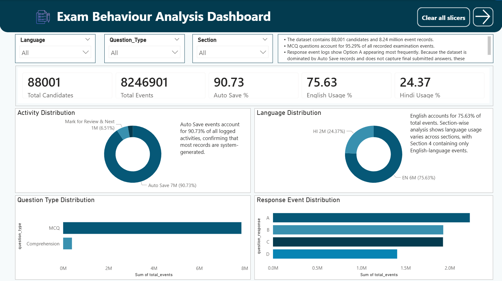

# Exam Behaviour Analysis Dashboard

## Project Overview

This project was completed as part of the **PRODIOSLABS Data Analyst Assignment**.

The objective of this analysis is to examine candidate behaviour during a large-scale online examination using event-level telemetry logs. The dataset contains over **8.24 million events** generated by **88,001 candidates** and captures candidate interactions, review actions, question responses, language preferences, and section-wise activity.

The analysis was performed using **PostgreSQL** for data exploration and **Power BI** for dashboard development.

---

# Objectives

* Analyze candidate interaction patterns.
* Identify section-wise engagement levels.
* Evaluate review behaviour across exam sections.
* Study language preferences and response distributions.
* Investigate time-based activity trends.
* Assess overall data quality and missing values.
* Build an interactive Power BI dashboard for decision-making.

---

# Tools & Technologies

* PostgreSQL
* SQL
* Power BI
* Power Query
* Data Visualization
* Data Analysis

---

# Dataset Information

| Metric           | Value              |
| ---------------- | ------------------ |
| Total Candidates | 88,001             |
| Total Events     | 8,246,901          |
| Languages        | English, Hindi     |
| Question Types   | MCQ, Comprehension |
| Sections         | 1 - 4              |

---

# Dataset Limitations

The following limitations were considered during the analysis:

* Approximately **91%** of records are **Auto Save** events.
* Login and navigation events were filtered from the dataset.
* No answer keys were provided.
* Candidate performance scoring was not possible.

---

# Data Processing & Transformation

The following steps were performed:

1. Restored the PostgreSQL dump file.
2. Validated table structure and row counts.
3. Performed missing value analysis.
4. Created SQL queries for:

   * Candidate Count
   * Activity Distribution
   * Language Distribution
   * Section Analysis
   * Question Type Analysis
   * Response Distribution
   * Review Behaviour Analysis
   * Hourly Activity Analysis
5. Imported aggregated results into Power BI.
6. Developed a 3-page interactive dashboard.

---

# Dashboard Pages

## Page 1: Executive Summary

### Key KPIs

* Total Candidates
* Total Events
* Auto Save %
* English Usage %
* Hindi Usage %

### Visuals

* Activity Distribution
* Language Distribution
* Question Type Distribution
* Response Distribution

### Insights

* Auto Save events account for **90.73%** of all activities.
* English is the preferred examination language (**75.63%**).
* MCQ questions dominate examination activity (**95.29%**).
* Option A was the most selected response.

## Dashboard Screenshot



## Page 2: Candidate Behaviour Analysis

### Key KPIs

* Section 1 Activity %
* Section 4 Activity %
* MCQ Share %
* Review Actions
* Missing Responses

### Visuals

* Section-wise Activity
* Activity by Section
* Review Actions by Section
* Unmark Review Actions by Section

### Insights

* Section 1 generated the highest engagement.
* Section 4 was the second most active section.
* Review actions were concentrated in Section 1.
* Candidates revisited a significant number of marked questions.

### Dashboard Screenshot

```markdown

```

---

## Page 3: Time & Data Quality Analysis

### Key KPIs

* Peak Activity Hour
* Peak Hour Events
* Missing Responses
* Missing Languages
* Missing Question Types

### Visuals

* Hourly Activity Trend
* Missing Value Analysis
* Section Activity Share
* Activity Distribution Treemap

### Insights

* Peak activity occurred at **16:00**.
* 764,464 records contained missing responses.
* No missing values were found in language or question type fields.
* Overall data quality was strong.

### Dashboard Screenshot

```markdown

```

---

# Key Findings

* Auto Save events account for **90.73%** of all records.
* English usage accounts for **75.63%** of interactions.
* MCQ questions represent **95.29%** of total activity.
* Sections 1 and 4 generated the highest engagement.
* Review actions occurred most frequently in Section 1.
* Peak activity occurred at **16:00**.
* Missing responses totaled **764,464** records.

---

# Recommendations

1. Focus behavioural analysis on review-related activities instead of Auto Save events.
2. Investigate Section 1 to understand increased review behaviour.
3. Monitor missing responses to improve examination usability.
4. Continue leveraging telemetry data to improve candidate experience.

---

# Repository Structure

```text
exam-behaviour-analysis-dashboard
│
├── Dashboard
│   └── Exam_Behaviour_Analysis.pbix
│
├── SQL
│   └── exam_behaviour_analysis.sql
│
├── Screenshots
│   ├── Page1_Executive_Summary.png
│   ├── Page2_Candidate_Behaviour.png
│   └── Page3_Time_Data_Quality.png
│
├── Reports
│   ├── Exam_Behaviour_Dashboard_Report.pdf
│   └── PRODIOSLABS_Exam_Behaviour_Report.docx
│
└── README.md
```

---

# Author

**Surbhi Jain**

Data Analyst | SQL | Power BI | Data Visualization
