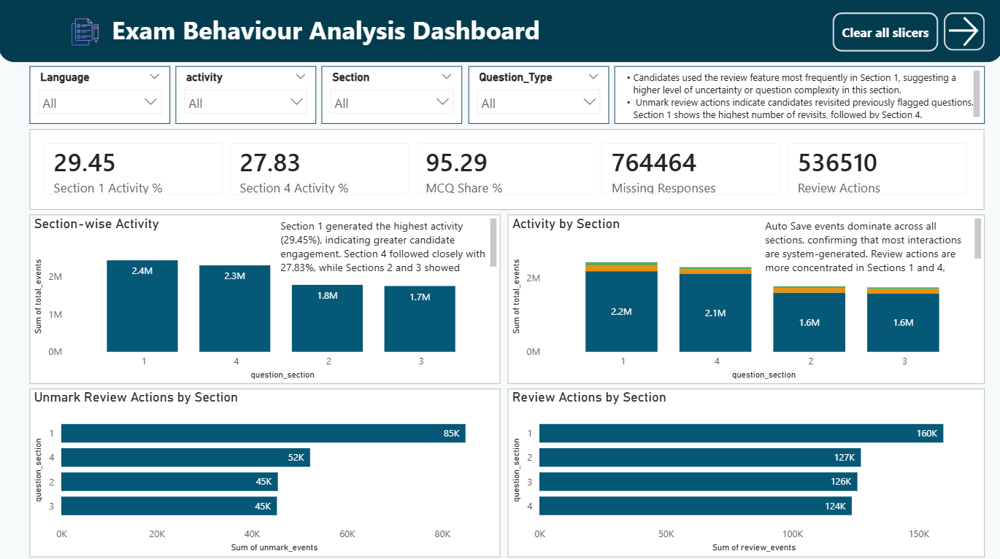
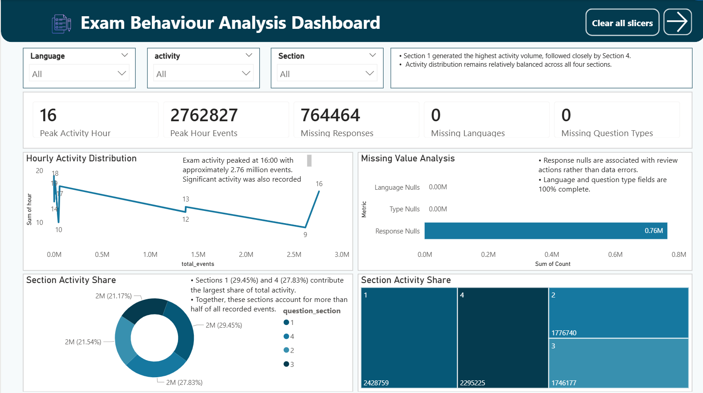

# Exam Behaviour Analysis Dashboard

## Project Overview

The objective of this analysis is to examine candidate behaviour during a large-scale online examination using event-level telemetry logs. The dataset contains over **8.24 million events** generated by **88,001 candidates** and captures candidate interactions, review actions, language preferences, question responses, and section-wise activity.

The analysis was performed using **PostgreSQL** for data exploration and transformation and **Power BI** for interactive dashboard development.

---

# Objectives

* Analyze candidate interaction patterns.
* Examine section-wise activity distribution.
* Evaluate review behaviour across examination sections.
* Study language preferences and question types.
* Identify hourly activity trends.
* Assess data completeness and quality.
* Build an interactive dashboard for decision-making.

---

# Tools & Technologies

* PostgreSQL
* SQL
* Power BI
* Power Query
* Data Visualization
* Data Analysis

---

# Dataset Information

| Metric           | Value              |
| ---------------- | ------------------ |
| Total Candidates | 88,001             |
| Total Events     | 8,246,901          |
| Languages        | English, Hindi     |
| Question Types   | MCQ, Comprehension |
| Sections         | 1–4                |

---

# Dataset Limitations

The following limitations were considered during the analysis:

* Approximately **90.73%** of records are Auto Save events.
* Login and navigation events were not available in the dataset.
* No answer keys were provided.
* Candidate performance scoring could not be evaluated.
* Response event counts should not be interpreted as final answer selections because Auto Save activity dominates the dataset.

---

# Data Processing & Transformation

The following steps were performed:

1. Restored the PostgreSQL dump file.
2. Validated table structure and row counts.
3. Checked composite key uniqueness using **(log_id, candidate_id)**.
4. Performed missing value analysis.
5. Created SQL queries for:

   * Candidate Count
   * Activity Distribution
   * Language Distribution
   * Section Analysis
   * Question Type Analysis
   * Response Distribution
   * Review Behaviour Analysis
   * Hourly Activity Analysis
   * Data Quality Analysis
6. Imported aggregated datasets into Power BI.
7. Created calculated KPIs and dashboard visuals.
8. Developed a 3-page interactive dashboard.

---

# Composite Key Validation

Composite key validation was performed using:

(log_id, candidate_id)

| Metric                | Value     |
| --------------------- | --------- |
| Total Rows            | 8,246,901 |
| Unique Composite Keys | 8,246,901 |

Result:

* No duplicate composite keys were identified.
* Dataset integrity was successfully validated.

---

# Dashboard Pages

## Page 1: Executive Summary

### Key KPIs

* Total Candidates
* Total Events
* Auto Save %
* English Usage %
* Hindi Usage %

### Visuals

* Activity Distribution (Donut Chart)
* Language Distribution (Donut Chart)
* Question Type Distribution (Bar Chart)
* Response Event Distribution (Bar Chart)

### Insights

* Auto Save events account for **90.73%** of all recorded activities.
* English accounts for **75.63%** of total events.
* MCQ questions represent **95.29%** of total examination activity.
* Response event logs show Option A appearing most frequently; however, due to the high volume of Auto Save events, these counts should not be interpreted as final answer preferences.

### Dashboard Screenshot


---

## Page 2: Candidate Behaviour Analysis

### Key KPIs

* Section 1 Activity %
* Section 4 Activity %
* MCQ Share %
* Missing Responses
* Review Actions

### Visuals

* Section-wise Activity
* Activity by Section
* Language Distribution by Section
* Review Actions by Section

### Insights

* Sections 1 and 4 generated the highest share of recorded activity.
* Language distribution varies across sections, with Section 4 containing only English-language events.
* Section 1 recorded the highest review count.
* Review-rate analysis shows Sections 2 and 3 have slightly higher review rates than Section 1.

### Dashboard Screenshot



---

## Page 3: Time & Data Quality Analysis

### Key KPIs

* Peak Activity Hour
* Peak Hour Events
* Missing Responses
* Missing Languages
* Missing Question Types

### Visuals

* Hourly Activity Distribution
* Missing Value Analysis
* Section Activity Share
* Section Activity Treemap

### Insights

* Peak activity occurred at **16:00**, generating approximately **2.76 million events**.
* Missing responses are associated with review-related activities rather than data errors.
* No missing values were found in language or question type fields.
* Sections 1 and 4 account for more than half of total recorded activity.

### Dashboard Screenshot



---

# Visualization Rationale

### Donut Charts

Used to display percentage contribution and proportional distribution of categories.

### Bar Charts

Used to compare counts across categories such as question types, responses, and review actions.

### 100% Stacked Bar Charts

Used to compare language distribution across sections while highlighting percentage contribution.

### Line Charts

Used to visualize hourly activity trends and identify peak activity periods.

### Treemap

Used to display the proportional contribution of each section to total recorded activity.

---

# Key Findings

* Auto Save events account for **90.73%** of all records.
* English accounts for **75.63%** of total activity.
* MCQ questions represent **95.29%** of examination events.
* Sections 1 and 4 contribute the largest share of recorded activity.
* Review behaviour is relatively consistent across sections when normalized by activity volume.
* Peak activity occurred at **16:00**.
* Missing responses are concentrated within review-related actions.

---

# Recommendations

1. Focus behavioural analysis on review-related actions rather than Auto Save events.
2. Use review-rate metrics in addition to raw review counts when comparing sections.
3. Investigate why Section 4 contains only English-language events.
4. Continue monitoring event telemetry to improve examination experience and platform usability.

---

# Repository Structure

```text
exam-behaviour-analysis-dashboard
│
├── DATA ANALYST ASSIGNMENT.pbix
├── query.sql
├── README.md
├── Page1_Executive_Summary.png
├── Page2_Candidate_Behaviour.png
├── Page3_Time_Data_Quality.png
├── PRODIOSLABS_Exam_Behaviour_Report.docx
└── Exam_Behaviour_Dashboard_Report.pdf
```

---

# Author

**Surbhi Jain**

Data Analyst | SQL | Power BI | Data Visualization
